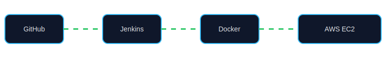
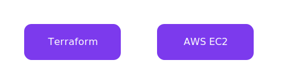

# 🍔 FoodHub – Full Stack DevOps Pipeline 🚀

<p align="center">
  
  
  
  
  <!--  -->
</p>


<p align="center">
  <b>An end-to-end food delivery application with complete DevOps automation</b>
</p>

---

## 🎯 Project Overview

FoodHub is a **full-stack food delivery application** integrated with a **real-world DevOps CI/CD pipeline**.

This project demonstrates how modern applications are:

- Developed using frontend and backend services
- Containerized using Docker
- Deployed on AWS using Infrastructure as Code
- Automatically built, tested, and deployed using CI/CD pipelines

---

## 🧱 Tech Stack

### 🖥 Frontend
- React.js (Vite)
- Responsive UI
- JWT-based authentication

### ⚙ Backend
- Node.js + Express.js
- RESTful APIs
- AI-powered chatbot using OpenAI API

### 🗄 Database
- PostgreSQL
- Auto-seeded restaurant & menu data

### ☁ DevOps & Cloud
- Docker & Docker Compose
- Jenkins (CI/CD)
- Terraform (AWS Infrastructure)
- Ansible (Configuration Management)
- AWS EC2

---

## 🔄 CI/CD Workflow 

<p align="center">
  
</p>

### How the pipeline works:
1. Developer pushes code to GitHub  
2. GitHub webhook triggers Jenkins  
3. Jenkins runs CI pipeline (build & test)  
4. Docker images are built  
5. Ansible deploys containers to AWS EC2  
6. Application goes live automatically  

---

## 🐳 Containerization with Docker

- Frontend, backend, and database run in **separate containers**
- Docker Compose orchestrates the multi-container setup
- Containers communicate via an internal Docker network
- Ensures consistency across development and production

---

## ☁ Infrastructure Automation (Terraform)

<p align="center">
  
</p>

### Infrastructure includes:
- AWS EC2 instances
- Custom VPC and Subnets
- Internet Gateway
- Security Groups (firewall rules)
- Elastic IPs

✔ Fully automated  
✔ Version-controlled  
✔ No manual AWS console configuration  

---

## 🔧 Configuration Management (Ansible)

- Installs Docker and required dependencies on EC2
- Pulls latest code from GitHub
- Stops old containers safely
- Deploys updated containers
- Ensures consistent and repeatable deployments

---

## 🤖 AI-Powered Food Assistant

<p align="center">
  
</p>

### Features:
- Helps users choose food items
- Answers menu-related questions
- Enhances overall user experience
- Powered by OpenAI API

---

## 🔐 Security Features

- JWT-based authentication
- Environment variables for secrets
- AWS Security Groups for network protection
- Encrypted EC2 volumes
- Ansible Vault support for secret management

---

## 🌍 Live Deployment

- **Frontend**  
  👉 http://13.203.190.4:3000

- **Backend API**  
  👉 http://13.203.190.4:4000

---

## 🔄 Complete Workflow (Text Diagram)

```text
Developer
   ↓
GitHub (Push)
   ↓
Jenkins CI/CD
   ↓
Docker Build
   ↓
Ansible Deploy
   ↓
AWS EC2
   ↓
Users Access Application
